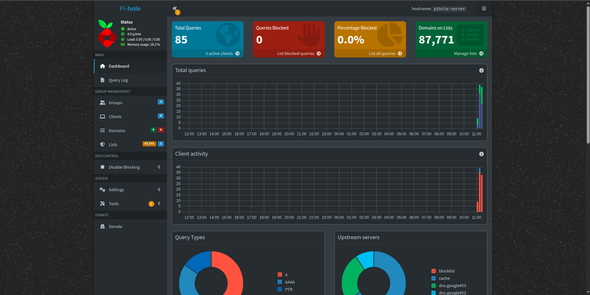
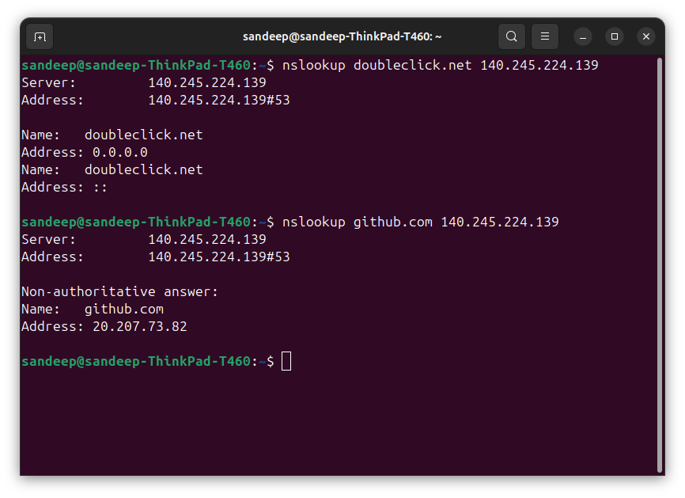
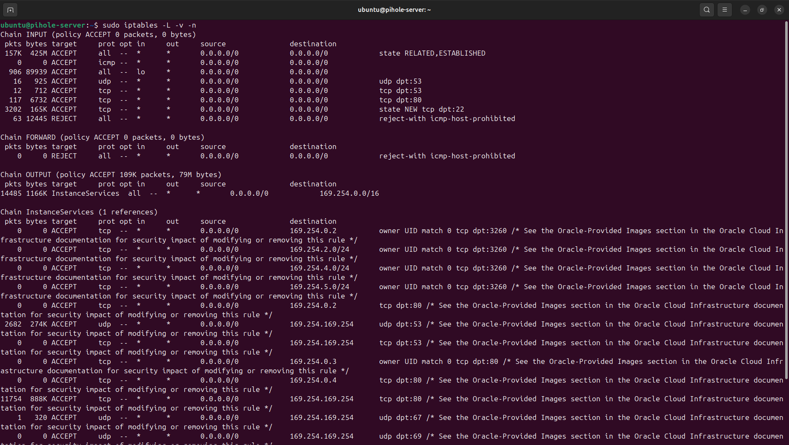

# Pi-hole DNS Server + Firewall

### A self-hosted DNS server deployed on Oracle Cloud with custom 
### iptables firewall rules

---

## 📋 Project Overview

This project deploys a fully functional Pi-hole DNS server on a free
Oracle Cloud VM and secures it with custom iptables firewall rules.
Pi-hole acts as a network-wide DNS server that blocks ads, malware
domains, and tracking domains at the DNS level before they reach
any device.

---

## 🏗️ Architecture

Your devices
|
| DNS queries (port 53)
▼
Pi-hole server (Oracle Cloud VM)
|
| Blocked domains → returns 0.0.0.0
| Allowed domains ↓
▼
Upstream DNS (Google 8.8.8.8)
|
▼
Real IP address returned

---

## ☁️ Infrastructure

| Detail | Value |
|---|---|
| Provider | Oracle Cloud Free Tier |
| OS | Ubuntu 22.04 LTS |
| Shape | VM.Standard.E2.1.Micro |
| Cost | Free (always free tier) |

---

## 🛠️ What's Configured

### Pi-hole
- Installed and configured as a network DNS server
- 4 custom blocklists added covering ads, malware, and tracking domains
- 90506 (88747 unique domains) domains blocked
- Web admin dashboard accessible
- DNS blocking verified — doubleclick.net returns 0.0.0.0

### Firewall (iptables)
- Default INPUT policy set to DROP
- Explicit rules for SSH, DNS (UDP+TCP) and HTTP
- Rules made persistent with iptables-persistent
- Principle of least privilege applied — only necessary ports open

---

## 🔒 Firewall Rules

Full firewall documentation in [firewall-rules.md](firewall-rules.md)

| Port | Protocol | Purpose |
|---|---|---|
| 22 | TCP | SSH administration |
| 53 | UDP/TCP | DNS queries |
| 80 | TCP | Pi-hole web interface |

---

## 📊 Screenshots

### Pi-hole dashboard

### DNS blocking verified

### Firewall rules

---

## 🧠 What I Learned

- How DNS works at a server level — not just client queries
- How Pi-hole intercepts and filters DNS queries
- How iptables chains and rules work
- The principle of default deny in firewall configuration
- Why rule ordering in iptables matters
- How to deploy and manage a Linux server on cloud infrastructure

---

## 📁 Files

| File | Description |
|---|---|
| `firewall-rules.md` | Full iptables rule documentation with rationale |
| `configs/pihole-config.md` | Server setup and configuration notes |
| `screenshots/` | All verification screenshots |

---

*Deployed on Oracle Cloud Free Tier — no cost involved*
